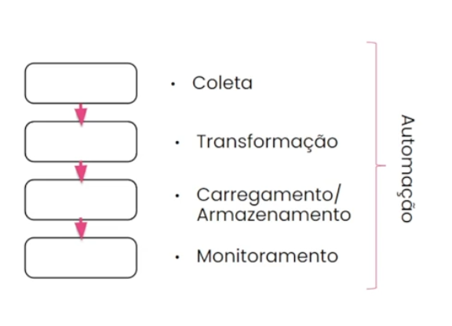
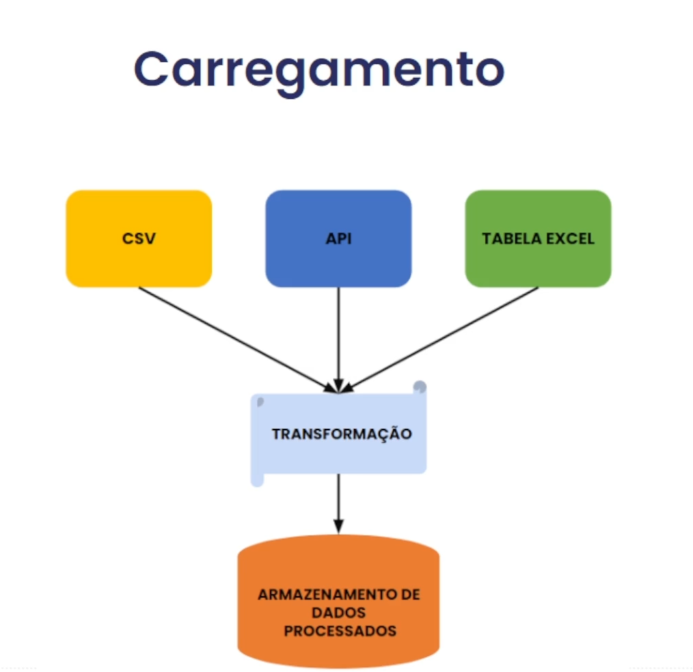

# Sklearn Pipelines

## O que é? 

Pipeline de dados em português, é um sistema que facilita a coleta, processamento e movimentação de dados de uma fonte para um destino específico. Uma pipeline de dados, em termos gerais, é uma série de processos ou etapas interligadas que são usadas para mover e transformar dados de um ponto de origem para um destino específico. As pipelines de dados são comumente usadas em projetos de ciência de dados, engenharia de dados, análise de dados e em geral em ambientes onde é necessário lidar com grandes volumes de dados de maneira eficiente e automatizada. 

## Qual a diferença de pipeline de dados de Data Wrangling?

Em data Wrangling estamos falando de uma manipulação de dados onde já temos os dados necessários para a nossa "receita" final.

Em Data Pipeline nós precisamos coletar esses dados, transformar ele e carrega-los. 

## (ETL - Extract Transform Load)

A ETL é como o processo de preparação de uma refeição completa, desde a escolha dos ingredientes (extração), o preparo (transformação) até colocar a comida na mesa (carregamento). No contexto de dados, ETL é o processo de mover dados de um lugar para o outro, transformá-los para atender às necessidade específicas e, finalmente, carregá-los em um local onde possam ser utilizados. Manipulação de dados é como organizar e preparar esses ingredientes para torná-los adequados à receita. Isso envolve limpar os ingredientes, cortá-los do jeito certo, misturar quando necessário, e garantir que tudo esteja pronto para ser usado. 

## Carregamento e armazenamento

Armazenando os dados transformados em um local de destino, como um banco de dados, uma data warehouse, ou mesmo um arquivo. 

## Monitoramento de dados

Diferentes tecnologias para monitoramente de dados.

- Apache Airflow
- Prometheus
- Grafana
- Datadog
- Azure Application Insights
- Python usando a biblioteca logging

## Automação

- O que é? 

Automação em uma pipeline de dados refere-se à capacidade de realizar tarefas e processos de forma programada e sem intervenção manual. Isso é essencial para garantir eficiência, consistência e confiabilidade em todo o fluxo de dados. Aqui estão alguns aspectos-chave da automação em uma pipeline de dados:

- Agendamento de Tarefas;
- Orquestração de fluxo de trabalho
- Gestão de dependências
- Monitoramento e notificação
- tratamento de erros e retentativas
- Gerenciamento de configuração
- Atualização automáticas
- Integração contínua e implantação contínua (CI/CD)
- Escalonamento automático

