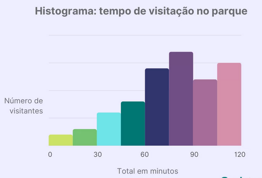
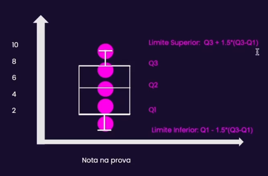
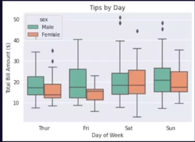
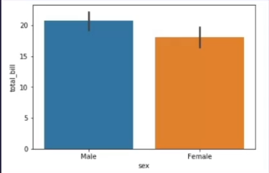

# Tipos de variáveis na análise estatística

## Numéricas                    x                   Categóricas

><b>Variáveis numéricas</b>: São variáveis mensuráveis:
>que possuem valores numéricos
>ou resultante de contagens. E são dividas em duas categorias

>1. <b>Variáveis numéricas discretas:</b> Assumem valores finitos e contáveis (EX: números inteiros INT).

>2. <b>Variáveis numéricas contínuas:</b> Assumem valores contínuos, mensurados a partir de algum instrumento. (FLOAT)

> <b>Variáveis Categóricas:</b> São variáveis qualitativas, classificam grupos ou indivíduos.

> 1. <b>Variáveis qualitativas ordinais:</b> Existe uma ordenação nas categorias (EX: Ruim, Médio, Bom).

>2. <b>Variáveis qualitativas nominais:</b> Variáveis em que não existe ordenação. (EX: Azul, Vermelho).

## Medidas de tendência central 

> O que são? São medidas que buscam visam "resumir" ou descrever os dados refletindo o ponto de equilíbrio ou "central" dos dados.

> Exemplo: Em uma entrevista cada uma das 10 candidatas respondeu em um tempo, x, específico a seguir em minutos: 2,3,1,4,2,2,3,1,4,2.

> Ordenando temos: 1,1,2,2,2,2,3,3,4,4.

> Média: Será a soma de todos os valores x dividido pelo numero total de candidatos. 

> Mediana: É o número que divide uma distribuição ordenada de dados em 2 partes iguais. 

> Moda: É a medida de maior frequência de um conjunto de dados. No exemplo o tempo que aparece mais frequentem é o 2. 

## Análise de dispersão de variáveis

> O que são? São medidas que buscam "resumir" como os dados estão distribuídos; o quão concentrados os dados estão em determinados intervalos e o grau de variação das informações. (somente para variáveis numéricas).

> Exemplo: Em uma entrevista cada uma das 10 candidatas respondeu uma pergunta em um tempo, x, específico e seguir em minutos.

> Amplitude: é a diferença entre o maior e o menor valor dos dados. EX: 4 - 1 = 3 é a amplitude do tempo de resposta. 

> Variância: É um número que nos diz o quão distante da média os dados estão. 

> Desvio Padrão: Também nos diz o quão distante da média estão os dados. É a raiz quadrada da variância. (Preserva a uynidade de medida original). 

### Variância populacional X Amostral

> Em muitos casos podemos encontrar medidas de dispersão "Populacionais" ou "Amostrais".

> As medidas <b>Populacionais</b> pode ser usadas quando estamos analisando dados de uma população completa "sem margem de erro";

> Já as medidas <b>Amostrais</b> são as mais frequentemente utilizadas no dia a dia. Vamos utilizar elas no caso de termos uma amostra de dados para analisar.

>Mas qual a diferença de formula delas?
>> A diferença das fórmulas está no denominador. No caso amostral dividimos por N-1, para aplicar um fator de correção e no caso populacional por N. 

### Amplitude, Variância e Desvio Padrão: Interpretando o Histograma

> O Histograma é um dos gráficos mais utilizados para se analisar a distribuição e a dispersão de variáveis numéricas. Ele é composto por: 

No eixo x: intervalosda distribuição dos dados, o número de intervalos é chamado de bins

No eixo y: a contagem dos dados naquele intervalo.

<b>Exemplos:</b> 

### Medidas de separatrizes

> Medidas separatrizes na estatística são métricas que dividem ou "separam" os dados em partes iguais.

EX: A mediana é uma separatriz, dividida em 50% percentis.

## Box plot

> O box plot é um gráfico de caixa em que traçamos visualmente algumas das medidas separatrizes mais importantes.

- Nele vamos ter uma caixa entre Q1 e Q3 (que são os quartis) que nos mostra limites superiores.

## Outliers

> Vimos que outliers são valores atípicos ou anômalos dos dados. Mas como podemos definir se um determinado dado é um outlier ou não? Como podemos identificar outliers em amostras ou bases de dados? 

1. Métodos de definição de Outliers:

> Método Z-score: O método z-score utiliza como referência a quantos desvios padrões a informação está na média:

<b>Z - score = (x - média)/ std</b>

Se Z-score > 3 ou Z-score < -3 desvios padrões geralmente se pode considerar um outlier. 

> Método IQR: O método IQR (distância inter-quartil em inglês) vê a distância da amplitude dos quartis, também conhecido por método de Tukey:

<b> IQR = Q3 - Q1 </b>

Se x > 1.5*IQR ou x < -1.5*IQR se pode considerar um outlier.

### A importância dos Outliers

> Outliers são importantes pois a existência deles já nos gera uma informação. Eles podem significar uma nova categoria ou um novo padrão nos dados.

> Mas a presença de outliers pode gerar ruído em modelos e análises estatísticas. Isso acontece porque métricas que envolvem distância podem ser sensíveis a outliers. EX: Modelo de regressão linear.

> A média é uma das métricas mais sensíveis aos outliers, portanto, devemos preferir utilizar a mediana no caso de outliers.

### Tratamento de outliers

- Para evitar o viés gerado por outliers em modelos e análises estatísticas podemos utilizar técnicas de tratamento de outliers. As mais conhecidas são:

> Caso o outlier não represente um sentido de negócio (Ex: fraude) temos as seguintes possibilidade:

>a. Remover os dados outliers da análise

>b. Substituir o valor dos outliers pela média ou mediana.

> Caso o outlier tenha um sentido de negócio:

>a. caso categórico: criar uma categoria nova para o outlier

>b. caso numérico: ionputar um valor para o outlier, ex: -999, -1, etc, para dados positivos. 

## Análise de variáveis numéricas e categóricas

### Análise exploratória de variáveis numéricas

- Quando vamos analisar dados é importante começarmos por uma análise exploratória dos dados pensando nas frequências e medidas dos dados.

Para as variáveis numéricas podemos analisar as seguintes características:

1. Média, mediana, moda
2. Variância e desvio padrão
3. Valores mínimos e máximos
4. Análise do histograma
5. Análise do boxplot (medidas separatrizes - quartis)
6. Verificar outliers
7. Verificar valores nulos ou faltantes

### Valores nulos e variáveis numéricas

- A análise dos valores nulos é uma etapa importante na análise exploratória dos dados. Em muitos casos no dia a dia podemos ter variáveis importantes e pouco preenchidas. Nesse caso quando devemos substituir os valores nulos? e por quais valores substituir.

> A substituição vai a critério do analista e da análise. 

Mas uma boa prática é: 

- Verificar se a informação faltante, assim como o outlier, possui sentido de negócio.
- Substituir pela média, mediana ou moda.
- Fazer um gráfico de barras de quantidade ou % de valores faltantes para cada variável. 

## Análise exploratória de variáveis categóricas

- Para as variáveis categóricas podemos analisar as seguintes características:

1. Moda dos dados
2. Análise da frequência das categorias ou cardinalidade:

    a. Quantas categorias existem?
    
    b. Qual a frequência de cada uma das categorias (gráfico de barras)?
3. Agrupamento de variáveis de alta cardinalidade.
4. Substituição de valores nulos: ou pela Moda ou criar a categoria "nulo".

## Análise cruzadas

### Análise exploratória variáveis numéricas x categóricas

- Em muitas análises estamos interessadas em entender padrões de variáveis numéricas e categóricas combinadas, por exemplo:
- Análise de distribuiçao de receita, vendas, gorgetas por: Dia da semana e por gênero:

